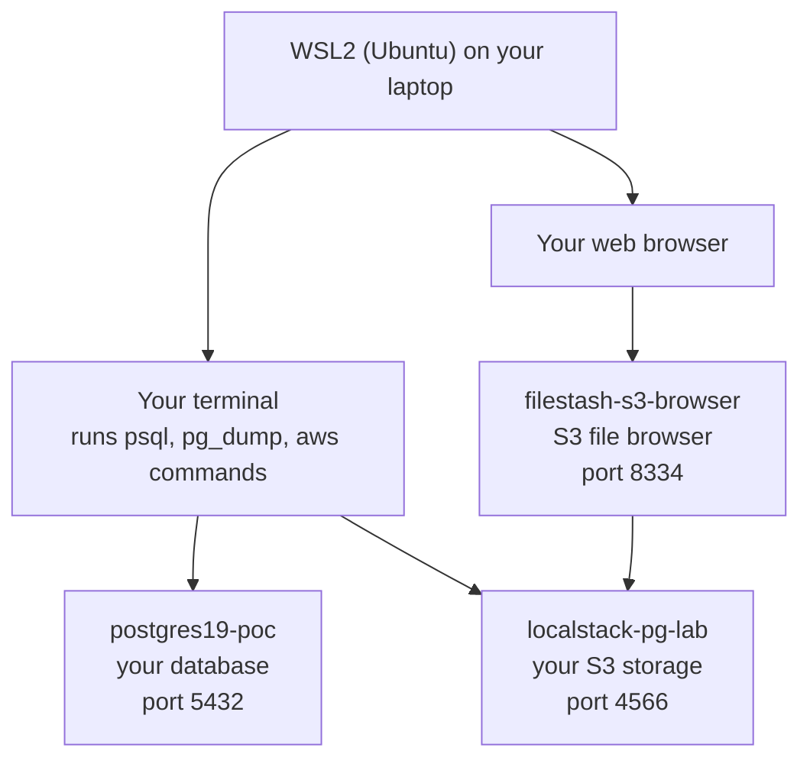
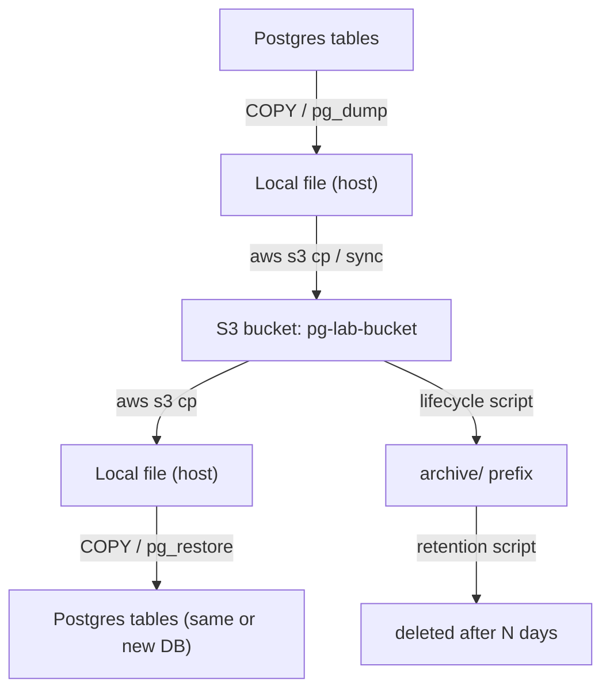

# PostgreSQL 19 Beta ↔ S3 Local Integration PoC (WSL + Docker + LocalStack)


**No AWS account · No credit card · No LocalStack login · No MinIO license · Runs entirely on your laptop.**
A hands-on PoC showing every common **PostgreSQL ↔ S3** data-movement pattern — backups, restores, CSV pipelines, migration, archival, bulk loads, and disaster recovery — fully local.

> **Why LocalStack and not MinIO?**
> The free `minio/minio` community image was discontinued in October 2025 — MinIO stopped publishing pre-built Docker/Quay images for the open-source edition, and their new "AIStor" containers require a paid license to run. To keep this PoC genuinely free and account-less, we reuse **LocalStack `4.4.0`** (the last free, no-signup release) as the S3-compatible engine — the same one from the standalone S3 lab.

---

## PART A — Architecture Overview

### A1. Infrastructure view



Everything starts in WSL2. Your terminal talks directly to the two backend containers: **postgres19-poc** (the database) and **localstack-pg-lab** (S3 storage pretending to be AWS). **filestash-s3-browser** is just a visual window into that same S3 storage — you open it in your browser instead of typing commands, and it reads/writes the same bucket behind the scenes.

### A2. Data flow view



Every scenario in this PoC is one of these four arrows: **export**, **land in S3**, **retrieve**, **load** — plus an archival/retention loop bolted onto the S3 side.

---

## PART B — Prerequisites & Folder Structure

```bash
docker --version
docker compose version
aws --version
```

```bash
mkdir -p ~/pg-s3-poc/{init-scripts,scripts,backups,exports,data/postgres,data/localstack}
cd ~/pg-s3-poc
```

Final layout:

```
~/pg-s3-poc/
├── docker-compose.yml
├── .pglab.sh                  # awslocal + pglocal shell functions
├── init-scripts/
│   ├── 01-schema.sql          # auto-run on first container start
│   └── 02-sample-data.sql
├── scripts/
│   ├── export-csv-to-s3.sh
│   ├── import-csv-from-s3.sh
│   ├── backup-to-s3.sh
│   ├── restore-from-s3.sh
│   ├── migrate-db.sh
│   ├── archive-retention.sh
│   ├── bulk-load.sh
│   └── dr-simulation.sh
├── backups/                   # local staging for .dump files
├── exports/                   # local staging for CSVs
└── data/
    ├── postgres/               # PG data directory (bind mount)
    └── localstack/              # LocalStack state (bind mount)
```

---

## PART C — `docker-compose.yml`

> ⚠️ Always generate this with the heredoc below — never hand-type YAML. Bad indentation is the #1 cause of `Additional property … is not allowed` errors.

```bash
cat > ~/pg-s3-poc/docker-compose.yml << 'EOF'
version: "3.8"

services:
  postgres19:
    container_name: postgres19-poc
    image: postgres:19beta1
    restart: unless-stopped
    environment:
      - POSTGRES_USER=labadmin
      - POSTGRES_PASSWORD=labpass
      - POSTGRES_DB=ecommerce_poc
      - POSTGRES_INITDB_ARGS=--data-checksums
    ports:
      - "5432:5432"
    volumes:
      - "./data/postgres:/var/lib/postgresql"
      - "./init-scripts:/docker-entrypoint-initdb.d:ro"
    networks:
      - pglab-net

  localstack:
    container_name: localstack-pg-lab
    image: localstack/localstack:4.4.0
    restart: unless-stopped
    ports:
      - "4566:4566"
    environment:
      - SERVICES=s3
      - DEFAULT_REGION=us-east-1
      - PERSISTENCE=1
    volumes:
      - "./data/localstack:/var/lib/localstack"
      - "/var/run/docker.sock:/var/run/docker.sock"
    networks:
      - pglab-net

  filestash:
    container_name: filestash-s3-browser
    image: machines/filestash:latest
    restart: unless-stopped
    ports:
      - "8334:8334"
    depends_on:
      - localstack
    networks:
      - pglab-net

networks:
  pglab-net:
    driver: bridge
EOF
```

> `POSTGRES_INITDB_ARGS=--data-checksums` makes the beta's default of checksums-on explicit rather than implicit — see the breaking-changes note in the standalone PG19 guide.
> Filestash is a free, open-source S3 browser GUI — it replaces LocalStack's own paid dashboard, same as in the standalone S3 lab.
> Since Postgres 18, the official image expects a single mount at `/var/lib/postgresql` (not `/var/lib/postgresql/data`) — it creates its own version-specific subdirectory underneath (e.g. `19/docker/`). Mounting at the old `.../data` path makes `initdb` refuse to start.

---

## PART D — Postgres Init Scripts (Sample Schema + Data)

These run automatically the **first** time the `postgres19` container starts (mounted at `/docker-entrypoint-initdb.d`).

```bash
cat > ~/pg-s3-poc/init-scripts/01-schema.sql << 'EOF'
CREATE TABLE customers (
    customer_id   SERIAL PRIMARY KEY,
    full_name     TEXT NOT NULL,
    email         TEXT UNIQUE NOT NULL,
    signup_date   DATE NOT NULL DEFAULT CURRENT_DATE
);

CREATE TABLE products (
    product_id    SERIAL PRIMARY KEY,
    product_name  TEXT NOT NULL,
    price         NUMERIC(10,2) NOT NULL
);

CREATE TABLE orders (
    order_id      SERIAL PRIMARY KEY,
    customer_id   INT REFERENCES customers(customer_id),
    order_date    DATE NOT NULL DEFAULT CURRENT_DATE,
    status        TEXT NOT NULL DEFAULT 'pending'
);

CREATE TABLE order_items (
    order_item_id SERIAL PRIMARY KEY,
    order_id      INT REFERENCES orders(order_id),
    product_id    INT REFERENCES products(product_id),
    quantity      INT NOT NULL,
    unit_price    NUMERIC(10,2) NOT NULL
);
EOF
```

```bash
cat > ~/pg-s3-poc/init-scripts/02-sample-data.sql << 'EOF'
INSERT INTO customers (full_name, email, signup_date)
SELECT
    'Customer ' || i,
    'customer' || i || '@example.com',
    CURRENT_DATE - (random() * 365)::int
FROM generate_series(1, 25) AS i;

INSERT INTO products (product_name, price)
SELECT
    'Product ' || i,
    round((random() * 200 + 5)::numeric, 2)
FROM generate_series(1, 15) AS i;

INSERT INTO orders (customer_id, order_date, status)
SELECT
    (random() * 24 + 1)::int,
    CURRENT_DATE - (random() * 180)::int,
    (ARRAY['pending','shipped','delivered','cancelled'])[floor(random()*4 + 1)]
FROM generate_series(1, 60) AS i;

INSERT INTO order_items (order_id, product_id, quantity, unit_price)
SELECT
    (random() * 59 + 1)::int,
    (random() * 14 + 1)::int,
    (random() * 4 + 1)::int,
    round((random() * 200 + 5)::numeric, 2)
FROM generate_series(1, 150) AS i;
EOF
```

---

## Step 1 — Environment Setup

```bash
cd ~/pg-s3-poc
```
Confirm `docker-compose.yml` and `init-scripts/*.sql` exist from Parts C & D above.

## Step 2 — Start Containers

```bash
docker compose up -d
docker compose ps
curl -s http://localhost:4566/_localstack/health
```
Expect `postgres19-poc`, `localstack-pg-lab`, and `filestash-s3-browser` all `Up`, and `"s3": "available"` in the health JSON.

## Step 3 — Create the `awslocal` / `pglocal` Shortcuts

```bash
aws configure set aws_access_key_id test --profile localstack
aws configure set aws_secret_access_key test --profile localstack
aws configure set region us-east-1 --profile localstack
```

```bash
cat > ~/pg-s3-poc/.pglab.sh << 'EOF'
awslocal() {
  aws --endpoint-url=http://localhost:4566 --profile localstack "$@"
}
pglocal() {
  docker exec -i postgres19-poc psql -U labadmin -d ecommerce_poc "$@"
}
EOF
```

```bash
grep -qxF 'source ~/pg-s3-poc/.pglab.sh' ~/.bashrc || echo 'source ~/pg-s3-poc/.pglab.sh' >> ~/.bashrc
source ~/pg-s3-poc/.pglab.sh
pglocal -c "SELECT count(*) FROM customers;"   # expect 25
```

## Step 4 — Configure S3-Compatible Storage (Bucket Creation)

```bash
awslocal s3 mb s3://pg-lab-bucket
awslocal s3 ls
```
Expect `pg-lab-bucket` listed. All scenarios below use prefixes inside this one bucket: `csv-exports/`, `full-backups/`, `archive/`, `migration/`, `bulk-loads/`.

### Optional: Browse the Bucket via GUI (Filestash)

Filestash is already running from Step 2 — no extra setup needed.

| Step | Action |
|---|---|
| Open browser | **http://localhost:8334** → set an admin password on first visit (Filestash-only, not LocalStack) |
| Connect to S3 | Storage: **S3** · Key: `test` · Secret: `test` · Endpoint: `http://localstack-pg-lab:4566` · ✅ Path style · Region: `us-east-1` |
| GUI operations | Browse `pg-lab-bucket`, drill into `csv-exports/`, `full-backups/`, `archive/`, `migration/`, `bulk-loads/` — drag-and-drop uploads/downloads, delete objects |

> Use the container name `localstack-pg-lab` as the endpoint host (not `localhost`) — Filestash reaches LocalStack over the `pglab-net` Docker network, not the host network.

## Step 5 — Export PostgreSQL Data to S3 (CSV)

```bash
cat > ~/pg-s3-poc/scripts/export-csv-to-s3.sh << 'EOF'
#!/usr/bin/env bash
set -euo pipefail
source ~/pg-s3-poc/.pglab.sh
TS=$(date +%Y%m%d_%H%M%S)

for TBL in customers products orders order_items; do
  docker exec postgres19-poc psql -U labadmin -d ecommerce_poc \
    -c "\COPY ${TBL} TO '/tmp/${TBL}.csv' WITH CSV HEADER"
  docker cp postgres19-poc:/tmp/${TBL}.csv ~/pg-s3-poc/exports/${TBL}.csv
  awslocal s3 cp ~/pg-s3-poc/exports/${TBL}.csv \
    s3://pg-lab-bucket/csv-exports/${TS}/${TBL}.csv
done
echo "Exported to s3://pg-lab-bucket/csv-exports/${TS}/"
EOF
chmod +x ~/pg-s3-poc/scripts/export-csv-to-s3.sh
~/pg-s3-poc/scripts/export-csv-to-s3.sh
```
Expected output: 4 `upload:` lines, then `Exported to s3://pg-lab-bucket/csv-exports/<timestamp>/`. Verify with `awslocal s3 ls s3://pg-lab-bucket/csv-exports/ --recursive`.

## Step 6 — Import PostgreSQL Data from S3 (CSV)

Imports into staging tables so the original data is never overwritten.

```bash
cat > ~/pg-s3-poc/scripts/import-csv-from-s3.sh << 'EOF'
#!/usr/bin/env bash
set -euo pipefail
source ~/pg-s3-poc/.pglab.sh
PREFIX="$1"   # e.g. csv-exports/20260715_101500

pglocal -c "CREATE TABLE IF NOT EXISTS customers_staging (LIKE customers INCLUDING ALL);"
pglocal -c "TRUNCATE customers_staging;"

awslocal s3 cp s3://pg-lab-bucket/${PREFIX}/customers.csv \
  ~/pg-s3-poc/exports/customers_from_s3.csv
docker cp ~/pg-s3-poc/exports/customers_from_s3.csv \
  postgres19-poc:/tmp/customers_from_s3.csv
docker exec postgres19-poc psql -U labadmin -d ecommerce_poc \
  -c "\COPY customers_staging FROM '/tmp/customers_from_s3.csv' WITH CSV HEADER"

pglocal -c "SELECT count(*) FROM customers_staging;"
EOF
chmod +x ~/pg-s3-poc/scripts/import-csv-from-s3.sh
```

Run it separately, against the **real** timestamp folder from your Step 5 output (not a placeholder — check with `awslocal s3 ls s3://pg-lab-bucket/csv-exports/` if you don't have it handy):

> Refer to Step 5 output for the actual timestamp folder name.

```bash
~/pg-s3-poc/scripts/import-csv-from-s3.sh csv-exports/20260715_071454   # example — swap for your own timestamp
```
Expected: `count` returns `25`, matching the source `customers` table.

## Step 7 — Backup PostgreSQL to S3 (Logical Backup, `pg_dump`)

```bash
cat > ~/pg-s3-poc/scripts/backup-to-s3.sh << 'EOF'
#!/usr/bin/env bash
set -euo pipefail
source ~/pg-s3-poc/.pglab.sh
TS=$(date +%Y%m%d_%H%M%S)
FILE="ecommerce_poc_${TS}.dump"

docker exec postgres19-poc pg_dump -U labadmin -d ecommerce_poc -F c -f /tmp/${FILE}
docker cp postgres19-poc:/tmp/${FILE} ~/pg-s3-poc/backups/${FILE}
awslocal s3 cp ~/pg-s3-poc/backups/${FILE} s3://pg-lab-bucket/full-backups/${FILE}
echo "Backup stored: s3://pg-lab-bucket/full-backups/${FILE}"
EOF
chmod +x ~/pg-s3-poc/scripts/backup-to-s3.sh
~/pg-s3-poc/scripts/backup-to-s3.sh
```
`-F c` = custom format: compressed, and restorable selectively with `pg_restore`. Expected: an `upload:` line and the final `Backup stored:` message.

## Step 8 — Restore PostgreSQL from S3

```bash
cat > ~/pg-s3-poc/scripts/restore-from-s3.sh << 'EOF'
#!/usr/bin/env bash
set -euo pipefail
source ~/pg-s3-poc/.pglab.sh
S3_KEY="$1"          # e.g. full-backups/ecommerce_poc_20260715_101500.dump
TARGET_DB="${2:-ecommerce_restore}"

awslocal s3 cp s3://pg-lab-bucket/${S3_KEY} ~/pg-s3-poc/backups/restore.dump
docker cp ~/pg-s3-poc/backups/restore.dump postgres19-poc:/tmp/restore.dump

docker exec postgres19-poc psql -U labadmin -d postgres \
  -c "DROP DATABASE IF EXISTS ${TARGET_DB};"
docker exec postgres19-poc psql -U labadmin -d postgres \
  -c "CREATE DATABASE ${TARGET_DB};"
docker exec postgres19-poc pg_restore -U labadmin -d ${TARGET_DB} /tmp/restore.dump

docker exec postgres19-poc psql -U labadmin -d ${TARGET_DB} -c "SELECT count(*) FROM customers;"
EOF
chmod +x ~/pg-s3-poc/scripts/restore-from-s3.sh
```

Run it separately, against the **real** `.dump` filename from your Step 7 output (not a placeholder — check with `awslocal s3 ls s3://pg-lab-bucket/full-backups/` if you don't have it handy):

> Refer to Step 7 output for the actual `.dump` filename.

```bash
~/pg-s3-poc/scripts/restore-from-s3.sh full-backups/ecommerce_poc_20260715_080228.dump   # example — swap for your own filename
```
Expected: final `count` = `25`, confirming the restored database matches the source.

---

## Step 9 — Additional PostgreSQL ↔ S3 Scenarios

### 9.1 Scheduled Backups to S3

Reuses `scripts/backup-to-s3.sh` (Step 7) under `cron`.

```bash
crontab -l 2>/dev/null > /tmp/cron.bak || true
echo "0 2 * * * /home/$USER/pg-s3-poc/scripts/backup-to-s3.sh >> /home/$USER/pg-s3-poc/backup.log 2>&1" >> /tmp/cron.bak
crontab /tmp/cron.bak
crontab -l
```
Runs a fresh `pg_dump` → S3 backup every day at 02:00. Check `~/pg-s3-poc/backup.log` after the next run.

> WSL2 note: `cron` doesn't start automatically on boot. Run `sudo service cron start` once per WSL session, or add it to your shell profile.

### 9.2 Data Migration Workflow (legacy schema → new schema)

Simulates migrating `customers` into a differently-shaped `customers_v2` (splits `full_name` into first/last) via an S3 staging hop — the same pattern used for cross-environment or cross-account migrations.

```bash
cat > ~/pg-s3-poc/scripts/migrate-db.sh << 'EOF'
#!/usr/bin/env bash
set -euo pipefail
source ~/pg-s3-poc/.pglab.sh

pglocal -c "CREATE TABLE IF NOT EXISTS customers_v2 (
  customer_id INT PRIMARY KEY,
  first_name TEXT, last_name TEXT, email TEXT, signup_date DATE
);"

docker exec postgres19-poc psql -U labadmin -d ecommerce_poc -c "\COPY (SELECT customer_id, split_part(full_name,' ',1) AS first_name, split_part(full_name,' ',2) AS last_name, email, signup_date FROM customers) TO '/tmp/customers_v2.csv' WITH CSV HEADER"

docker cp postgres19-poc:/tmp/customers_v2.csv ~/pg-s3-poc/exports/customers_v2.csv
awslocal s3 cp ~/pg-s3-poc/exports/customers_v2.csv s3://pg-lab-bucket/migration/customers_v2.csv

awslocal s3 cp s3://pg-lab-bucket/migration/customers_v2.csv ~/pg-s3-poc/exports/customers_v2_in.csv
docker cp ~/pg-s3-poc/exports/customers_v2_in.csv postgres19-poc:/tmp/customers_v2_in.csv
docker exec postgres19-poc psql -U labadmin -d ecommerce_poc \
  -c "\COPY customers_v2 FROM '/tmp/customers_v2_in.csv' WITH CSV HEADER"

pglocal -c "SELECT * FROM customers_v2 LIMIT 5;"
EOF
chmod +x ~/pg-s3-poc/scripts/migrate-db.sh
~/pg-s3-poc/scripts/migrate-db.sh
```

### 9.3 Archival & Retention

> LocalStack Community doesn't reliably enforce S3 Lifecycle rules, so retention is handled with a plain script instead — more transparent for learning anyway.

```bash
cat > ~/pg-s3-poc/scripts/archive-retention.sh << 'EOF'
#!/usr/bin/env bash
set -euo pipefail
source ~/pg-s3-poc/.pglab.sh
ARCHIVE_AFTER_DAYS=7
DELETE_AFTER_DAYS=30

awslocal s3api list-objects-v2 --bucket pg-lab-bucket --prefix full-backups/ \
  --query "Contents[?LastModified<='$(date -d "-${ARCHIVE_AFTER_DAYS} days" -Iseconds)'].Key" \
  --output text | tr '\t' '\n' | while read -r KEY; do
    [ -z "$KEY" ] && continue
    BASENAME=$(basename "$KEY")
    awslocal s3 cp "s3://pg-lab-bucket/${KEY}" "s3://pg-lab-bucket/archive/${BASENAME}"
    awslocal s3 rm "s3://pg-lab-bucket/${KEY}"
    echo "Archived: ${BASENAME}"
done

awslocal s3api list-objects-v2 --bucket pg-lab-bucket --prefix archive/ \
  --query "Contents[?LastModified<='$(date -d "-${DELETE_AFTER_DAYS} days" -Iseconds)'].Key" \
  --output text | tr '\t' '\n' | while read -r KEY; do
    [ -z "$KEY" ] && continue
    awslocal s3 rm "s3://pg-lab-bucket/${KEY}"
    echo "Deleted (past retention): ${KEY}"
done
EOF
chmod +x ~/pg-s3-poc/scripts/archive-retention.sh
```
Run daily via cron alongside Step 9.1; against fresh PoC data nothing will move until you backdate an object or wait a week.

### 9.4 Bulk Data Loading

```bash
cat > ~/pg-s3-poc/scripts/bulk-load.sh << 'EOF'
#!/usr/bin/env bash
set -euo pipefail
source ~/pg-s3-poc/.pglab.sh

pglocal -c "CREATE TABLE IF NOT EXISTS bulk_orders (
  id INT, customer_id INT, amount NUMERIC(10,2), created_at TIMESTAMP
);"

docker exec postgres19-poc psql -U labadmin -d ecommerce_poc -c "\COPY (SELECT i, (random()*24+1)::int, round((random()*300)::numeric,2), now() - (random() * interval '365 days') FROM generate_series(1,100000) AS i) TO '/tmp/bulk_orders.csv' WITH CSV"

docker cp postgres19-poc:/tmp/bulk_orders.csv ~/pg-s3-poc/exports/bulk_orders.csv
awslocal s3 cp ~/pg-s3-poc/exports/bulk_orders.csv s3://pg-lab-bucket/bulk-loads/bulk_orders.csv

awslocal s3 cp s3://pg-lab-bucket/bulk-loads/bulk_orders.csv ~/pg-s3-poc/exports/bulk_orders_in.csv
docker cp ~/pg-s3-poc/exports/bulk_orders_in.csv postgres19-poc:/tmp/bulk_orders_in.csv
time docker exec postgres19-poc psql -U labadmin -d ecommerce_poc \
  -c "\COPY bulk_orders FROM '/tmp/bulk_orders_in.csv' WITH CSV"

pglocal -c "SELECT count(*) FROM bulk_orders;"
EOF
chmod +x ~/pg-s3-poc/scripts/bulk-load.sh
~/pg-s3-poc/scripts/bulk-load.sh
```
Expected: `count` = `100000`; the `time` output shows load duration (typically a few seconds on a laptop).

### 9.5 Logical Backup and Restore (table-level, selective)

`pg_dump -F c` supports partial restore — useful when you only need one table back.

```bash
docker exec postgres19-poc psql -U labadmin -d ecommerce_restore \
  -c "DROP TABLE IF EXISTS customers CASCADE;"
docker exec postgres19-poc pg_restore -U labadmin -d ecommerce_restore \
  --table=customers /tmp/restore.dump
docker exec postgres19-poc psql -U labadmin -d ecommerce_restore -c "SELECT count(*) FROM customers;"
```

> `pg_restore -c` (clean) issues a plain `DROP TABLE` with no `CASCADE` — if other objects in the target DB depend on the table (an FK from `orders`, a sequence default on `customers_staging`, etc.) the drop fails and everything after it fails too. Dropping manually with `CASCADE` first sidesteps that — but note `CASCADE` also removes those dependent objects (e.g. the `orders_customer_id_fkey` constraint), and a single-table restore doesn't bring them back. Fine for recovering one table's data; if you need referential integrity restored too, also restore the referencing table(s) or re-add the constraint by hand.

### 9.6 Disaster Recovery Simulation

See Step 10 below — it walks through a full simulated outage end-to-end.

---

## Step 10 — Validation & Testing (Disaster Recovery Simulation)

```bash
cat > ~/pg-s3-poc/scripts/dr-simulation.sh << 'EOF'
#!/usr/bin/env bash
set -euo pipefail
source ~/pg-s3-poc/.pglab.sh

echo "1) Baseline row counts:"
pglocal -c "SELECT 'customers' t, count(*) FROM customers
            UNION ALL SELECT 'orders', count(*) FROM orders;"

echo "2) Fresh backup to S3:"
~/pg-s3-poc/scripts/backup-to-s3.sh
LATEST=$(awslocal s3 ls s3://pg-lab-bucket/full-backups/ | sort | tail -n1 | awk '{print $4}')

echo "3) Simulating disaster: dropping the primary database..."
docker exec postgres19-poc psql -U labadmin -d postgres -c "DROP DATABASE ecommerce_poc WITH (FORCE);"
docker exec postgres19-poc psql -U labadmin -d postgres -c "\l" | grep ecommerce_poc || echo "Confirmed: ecommerce_poc no longer exists."

echo "4) Recovering from S3 backup: full-backups/${LATEST}"
~/pg-s3-poc/scripts/restore-from-s3.sh full-backups/${LATEST} ecommerce_poc

echo "5) Post-recovery row counts (should match Step 1):"
pglocal -c "SELECT 'customers' t, count(*) FROM customers
            UNION ALL SELECT 'orders', count(*) FROM orders;"
EOF
chmod +x ~/pg-s3-poc/scripts/dr-simulation.sh
~/pg-s3-poc/scripts/dr-simulation.sh
```
Expected: the row counts printed in step 5 exactly match step 1 — proving a full database was rebuilt purely from the S3-stored backup after simulated total loss.

**General validation checklist:**
| Check | Command | Expected |
|---|---|---|
| Both containers healthy | `docker compose ps` | both `Up` |
| S3 reachable | `curl -s http://localhost:4566/_localstack/health` | `"s3": "available"` |
| Bucket exists | `awslocal s3 ls` | `pg-lab-bucket` |
| Source data intact | `pglocal -c "SELECT count(*) FROM customers;"` | `25` |
| Backup round-trips | Steps 7 → 8 | restored count == source count |
| DR round-trips | Step 10 | pre/post counts identical |

---

## PART J — Cleanup

```bash
# Stop containers (keep data)
docker compose stop

# Stop + remove containers and the custom network
docker compose down

# Full wipe: containers, network, and local bind-mounted data
docker compose down -v
sudo rm -rf ~/pg-s3-poc/data/postgres/* ~/pg-s3-poc/data/localstack/*

# Remove local staging files (backups, exports, csvs)
rm -rf ~/pg-s3-poc/backups/* ~/pg-s3-poc/exports/*

# Remove Docker images
docker rmi postgres:19beta1 localstack/localstack:4.4.0 machines/filestash:latest

# Remove the cron entry from Step 9.1 (if added)
crontab -l | grep -v 'pg-s3-poc/scripts/backup-to-s3.sh' | crontab -

# Remove the awslocal/pglocal shortcut
sed -i '/source ~\/pg-s3-poc\/.pglab.sh/d' ~/.bashrc
rm -f ~/pg-s3-poc/.pglab.sh

# Remove the whole project folder
rm -rf ~/pg-s3-poc
```

---

## Troubleshooting

| Symptom | Cause | Fix |
|---|---|---|
| `postgres:19: not found` | PG19 is still beta; there's no plain `19` tag yet | Use `postgres:19beta1` |
| `there appears to be PostgreSQL data in: /var/lib/postgresql/data (unused mount/volume)` — container keeps restarting | PG18+ images expect a single mount at `/var/lib/postgresql`, not `.../data` | Mount `./data/postgres:/var/lib/postgresql` (Part C) |
| `License activation failed` on LocalStack | Using `latest` tag instead of the pinned free release | Use `localstack/localstack:4.4.0` |
| `pull access denied for minio/minio` or console shows "Community Edition" limits | MinIO discontinued free Docker images (Oct 2025) | Use LocalStack instead (this guide) |
| `relation "customers_staging" does not exist` | Staging table created only when Step 6 script runs first | Run `import-csv-from-s3.sh` once before querying it manually |
| `pg_restore: error: could not open input file` | `docker cp` target path mismatch | Confirm the `.dump` file actually landed in `~/pg-s3-poc/backups/` before `docker cp` into the container |
| `cron` job never fires in WSL2 | `cron` daemon isn't started automatically | `sudo service cron start` each WSL session |
| `Additional property … is not allowed` on `docker compose up` | Hand-typed YAML with bad indentation | Regenerate `docker-compose.yml` with the heredoc in Part C |
| Filestash: connection refused / can't list buckets | Wrong endpoint or Path style unchecked | Use `http://localstack-pg-lab:4566` (container name, not `localhost`) + enable Path style |
| `ERROR: syntax error at or near "\"` when running a `\COPY` command | `\COPY` is a psql backslash meta-command — it terminates at the first newline, so a multi-line query breaks it into invalid fragments | Put the entire `\COPY (...)` command on one line |
| `cannot drop table ... because other objects depend on it` during `pg_restore -c --table=...` | `pg_restore -c` drops without `CASCADE`; a selective restore's target table has FK/sequence dependents already in the DB | `DROP TABLE ... CASCADE;` manually first, then `pg_restore` without `-c` (Step 9.5) |
| Row counts don't match after restore | Restoring into a DB that already had data | Always `DROP DATABASE ... WITH (FORCE)` / recreate before `pg_restore`, as scripted in Step 8 |

---

## Quick Reference Cheat Sheet

| Task | Command |
|---|---|
| Start lab | `docker compose up -d` |
| Health check | `curl -s http://localhost:4566/_localstack/health` |
| Connect to Postgres | `pglocal` |
| List S3 objects | `awslocal s3 ls s3://pg-lab-bucket --recursive` |
| Browser GUI (S3) | http://localhost:8334 |
| Export table → S3 | `~/pg-s3-poc/scripts/export-csv-to-s3.sh` |
| Import table ← S3 | `~/pg-s3-poc/scripts/import-csv-from-s3.sh <prefix>` |
| Full backup → S3 | `~/pg-s3-poc/scripts/backup-to-s3.sh` |
| Restore ← S3 | `~/pg-s3-poc/scripts/restore-from-s3.sh <s3-key> [db-name]` |
| Bulk load 100k rows | `~/pg-s3-poc/scripts/bulk-load.sh` |
| Run DR simulation | `~/pg-s3-poc/scripts/dr-simulation.sh` |
| Stop lab | `docker compose down` |
| Full reset | `docker compose down -v && sudo rm -rf data/*` |

**Postgres:** `localhost:5432` (`labadmin` / `labpass` / `ecommerce_poc`)
**S3 endpoint:** `http://localhost:4566`
**Browser GUI:** `http://localhost:8334`
**Bucket:** `pg-lab-bucket` (`csv-exports/`, `full-backups/`, `archive/`, `migration/`, `bulk-loads/`)
